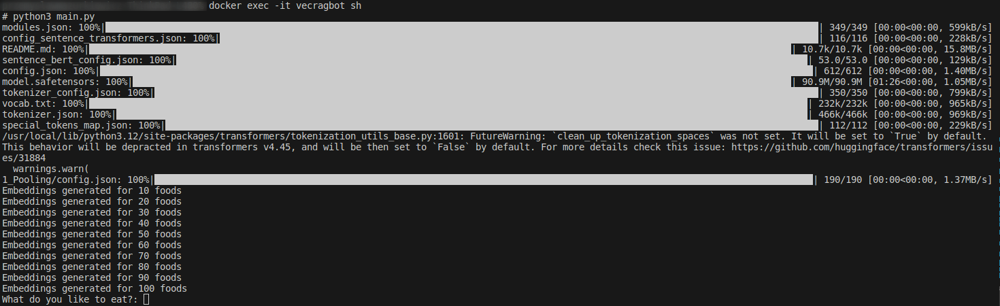

# Vector Search App for CSV Data

This project demonstrates a vector search application that queries through a provided list of 100 foods in a `food.csv` file. After running the commands below, you will be prompted to provide a text input, and the app will return the closest similar food entry from the database.

## Prerequisites

Make sure you have the following installed:

- Docker
- Docker Compose

## CSV File Format

You can customize the `food.csv` file as needed, but ensure it follows the proper format. All fields must be provided in the following order:

```
Name,Calories,Fat,Protein,Carbohydrate,Sugar,Fiber
```

### Example Entry:

```
Rose donuts,356,11,7.1,56,50,1.2
```

## Setup Instructions

### Step 1: Clean Up Existing Docker Containers and Images

If you've previously set up the project and want to start fresh, you'll need to remove any existing Docker containers and images.

1. **Find Container IDs:**
   ```sh
   docker container ps -a
   ```

2. **Stop and Remove Containers:**
   ```sh
   docker stop vecragbot qdrant && docker rm vecragbot qdrant
   ```

3. **Remove the Python App Image:**
   ```sh
   docker rmi vecragbot-pythonapp
   ```

### Step 2: Start the Application

1. **Build and Start the Containers:**
   ```sh
   docker compose up --build -d
   ```

   - This command will rebuild images if they already exist, ensuring the containers run on the correct images.
   - If no previous images exist, new ones will be created. 
   - It will take a while for docker to download and install all necessary dependencies, sentence-transformers package is huge. 

### Step 3: Run the Vector Search

1. **Access the `vecragbot` Container:**
   Open a new terminal window and run:
   ```sh
   docker exec -it vecragbot sh
   ```

2. **Execute the Python Script:**
   In the container terminal, run:
   ```sh
   python3 ./main.py
   ```

   - This script installs all necessary data, creates a collection in Qdrant, vectorizes the data stored in `food.csv`, uploads it to the database, prompts you with a question, and then returns the nearest found answer.

### Step 4: Updating the CSV and Rerunning the Script

If you add new food entries to the `food.csv` file, rerun the script to update the database:

```sh
python3 ./main.py
```

## Qdrant UI

You can manage collections, points, and other database entities using the Qdrant UI:

[http://localhost:6333/dashboard](http://localhost:6333/dashboard)

## Embedding Model

The application uses the following model to create embeddings:

[https://huggingface.co/sentence-transformers/all-MiniLM-L6-v2](https://huggingface.co/sentence-transformers/all-MiniLM-L6-v2)

1. Containers starting process


2. App initialization


3. Querying through provided file
