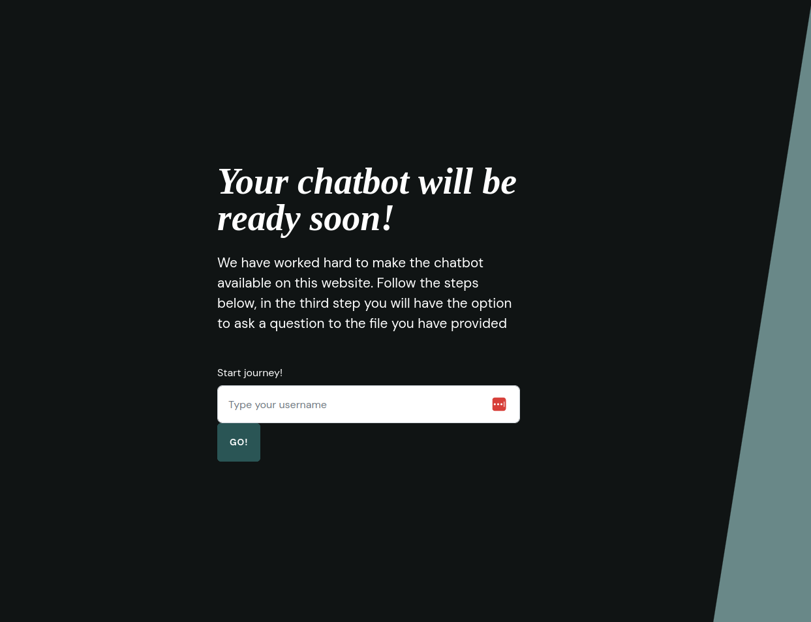
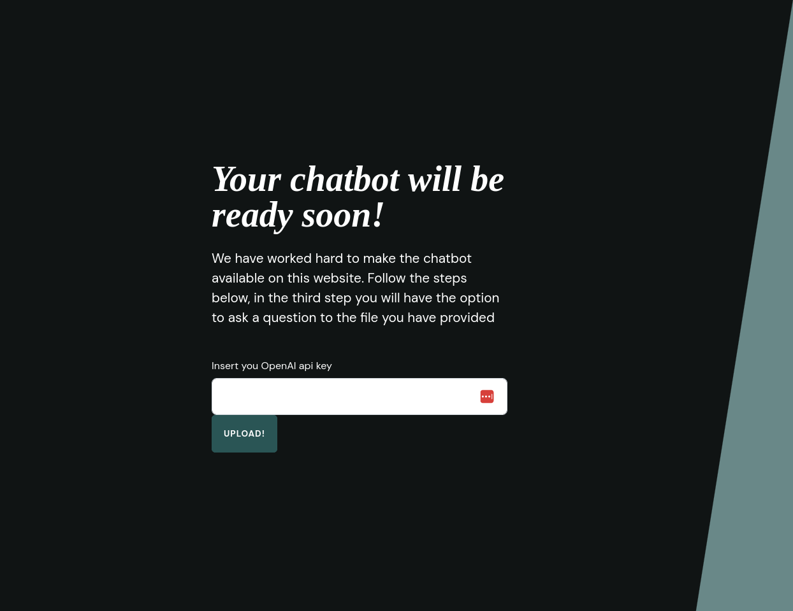
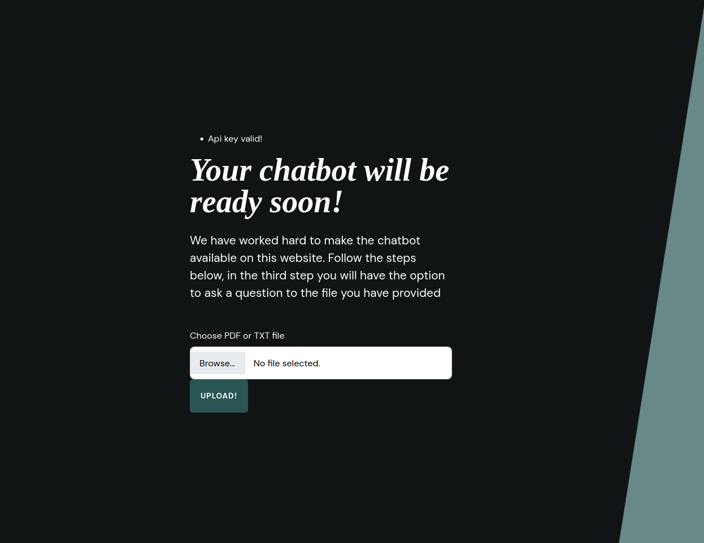
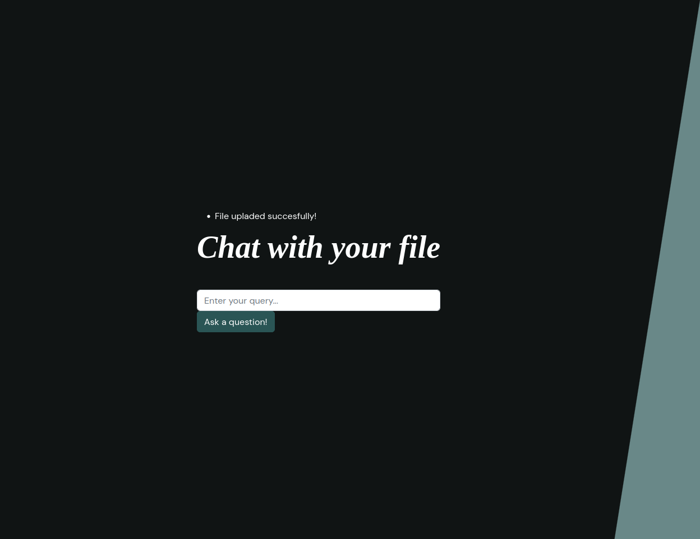
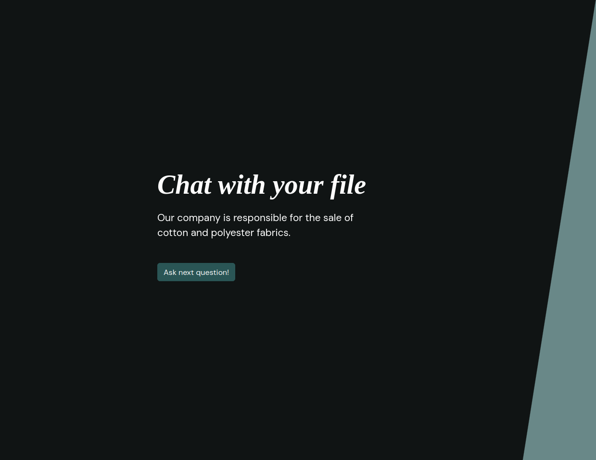

# VecRagBot - chatbot based on provided .pdf or .txt file

## Prerequisites

Before starting the project, ensure you have the following tools installed on your system:

1. **Docker** 
2. **Docker Compose**
3. **Pyenv** - with Python version `3.12.4` installed.
4. **Pipenv** 

## Getting Started

Follow these steps to set up and run the application. Run all that commands in main folder of the app:

### 1. Start Docker Containers

The application uses the Qdrant vector database, which is containerized. To start the required containers, run:

```bash
docker compose up
```

This command will start the Qdrant vector database in a Docker container.

### 2. Install Dependencies

Install all the required Python packages in virtual environment:

```bash
pipenv install
```

This command install all dependencies in your virtual environment, that are provided in Pipfile.lock file.

### 3. Initialize Python Virtual Environment

Initialize the Python virtual environment using Pipenv:

```bash
pipenv shell
```

This will activate the virtual environment..

### 4. Start the Application

With the virtual environment active and all dependencies installed, start the application by running:

```bash
python3 app.py
```

### 5. Access the Application

Once the application is running, you can access the main page by navigating to the following URL in your web browser:

[http://127.0.0.1:5000/index](http://127.0.0.1:5000/index)

## Conclusion

You should now be able to see the main page of the application. If you encounter any issues, ensure all prerequisites are correctly installed and the commands are executed in the correct order.


# Application Workflow

Follow the steps below to use the application effectively:

### 1. Username Entry

On the main page, you are asked to provide your username. This is necessary to track your chat history and ensure the application uses the correct collection in the Qdrant database, preventing redundant embedding of your data.



### 2. OpenAI API Key Entry

In the first step, you will be prompted to provide your OpenAI API key. This key is essential for the app's operation. We use it once to embed the data provided in a file and to enable the OpenAI-powered chatbot that responds based on the context of your file.

- Your OpenAI account will only be charged once for embedding the file, and each time you submit a query and receive a generated answer.
- Please create an account on OpenAI, generate your API key, and paste it into the form. More information can be found [here](https://platform.openai.com/api-keys).
- **Important:** We do not store your API key! It is used only during your active session in the app.



### 3. File Upload

In the second step, you will be asked to upload the file you want to query. The application accepts only `.pdf` and `.txt` files. During this step, your file will be embedded and uploaded to the Qdrant database. This step may take some time, depending on the size of the file.



### 4. Querying Your File

In the third step, you can start querying the content of your file. After submitting your first query, you can continue asking as many queries as you like.




## Conclusion

### Enjoy using my app! If you have any ideas, create a PR or share them with me, I'll try to extend it! 
