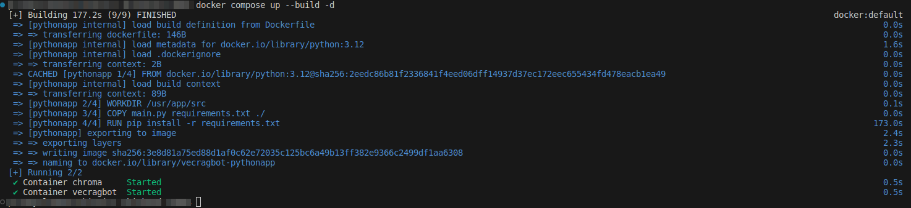
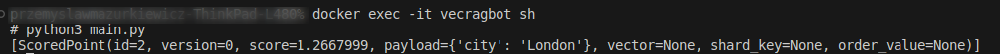

you need to have installed docker and docker compose

App works as a vector search, querying through provided 10 strings. Interactive shell will ask you a question.
After answering the question, you should be able to see 3 closest answers based on stored data provided in main.py list. Change the data in [6-20 line], rebuild the app, to create new embeddings, then in interactive terminal type question connected to that data you changed. You will see 3 closest answer based on your data. You can also change the metadata, but it is not used for now in the result. 

1. Start the app : 
    - in main folder run in terminal : docker compose up --build -d

If you changed the project/branch, and you have already created images/containers please remove them before starting new project from other branch, in terminal :

    - "docker container ps -a" : find your 2 containers ids

    - "docker stop pythonContainerId chromaContainerId && docker rm pythonContainerId chromaContainerId"

    - "docker rmi vecragbot-pythonapp" - to remove built pythonapp image

And the last command to run is : "docker compose up --build -d" 

- it will rebuild already created images, to be sure we build containers on proper images If you do not have any, it will create new one, if you have some, old will be replaced with new one

Succesfully build app process : 

After successfully creating the containers :

    - get into the vecrabot container, type in the console : "docker exec -it vecragbot sh" - it will take you to the console inside the container

    - next, type in the container terminal "python3 ./main.py" - it will take a while for chromadb to pull the LLM for creating embeddings, time of this process is related to your internet connection
    - After that, it will start to getting your input, and based on that return 3 closest matches. 

Here is the visualisation of the process inside the vecragbot container : 

1. You go into the python app container
2. LLM is being downloaded
3. Console asks you a question
4. It returns 3 colsest matches stored in main.py file list. 
5. Question is repeated. 