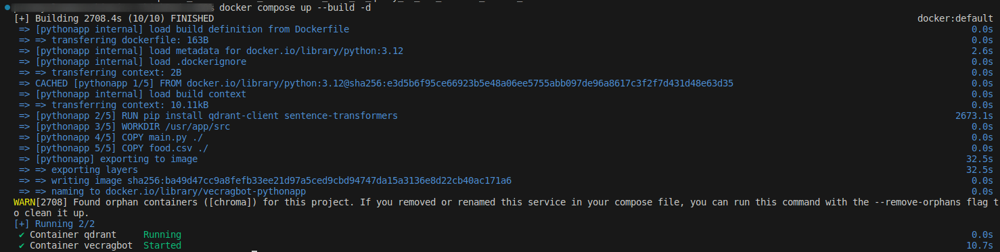
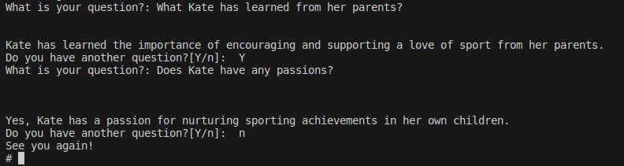

# Ineractive RAG app. Answers your question to provided file

App works as a Question Answer system, based on context data given in article.txt file. After running below commands, you will be asked to put some questions, connected to the file you will provide. App based on given context (your file) and with help of OpenAI LLM will give you an answer.

## Prerequisites

Make sure you have the following requirements:

- Docker
- Docker Compose
- OpenAI Api key

## .txt file 

You can customize the article.txt file, provide any data you want into it. 


## Setup Instructions

### Step 1: Clean Up Existing Docker Containers and Images

If you've previously set up the project and want to start fresh, you'll need to remove any existing Docker containers and images.

1. **Find Container IDs:**
   ```sh
   docker container ps -a
   ```

2. **Stop and Remove Containers:**
   ```sh
   docker stop vecragbot qdrant && docker rm vecragbot qdrant
   ```

3. **Remove the Python App Image:**
   ```sh
   docker rmi vecragbot-pythonapp
   ```

### Step 2: Start the Aplication

1. **.envsample:**
   - Change .envsample into .env, and change there '<your_key>' with your OpenAi Api key - without it app will not work. 

2. **Build and Start the Containers:**
   ```sh
   docker compose up --build -d
   ```

   - This command will rebuild images if they already exist, ensuring the containers run on the correct images.
   - If no previous images exist, new ones will be created. 
   - It will take a while for docker to download and install all necessary dependencies.

### Step 3: Run the App

1. **Access the `vecragbot` Container:**
   Open a new terminal window and run:
   ```sh
   docker exec -it vecragbot sh
   ```

2. **Execute the Python Script:**
   In the container terminal, run:
   ```sh
   python3 ./main.py
   ```

   - This script :
    - installs all necessary data 
    - creates a collection in Qdrant
    - vectorizes data stored in `article.txt'
    - uploads it to the database
    - prompts you with a question, and then returns prepared answer.

### Step 4: Updating the .txt file and rerunning the Script

If you add new data to the `article.txt` file, rerun the script to update the database:

```sh
python3 ./main.py
```

## Qdrant UI

You can manage collections, points, and other database entities using the Qdrant UI:

[http://localhost:6333/dashboard](http://localhost:6333/dashboard)


1. Containers starting process


2. Querying through provided file
