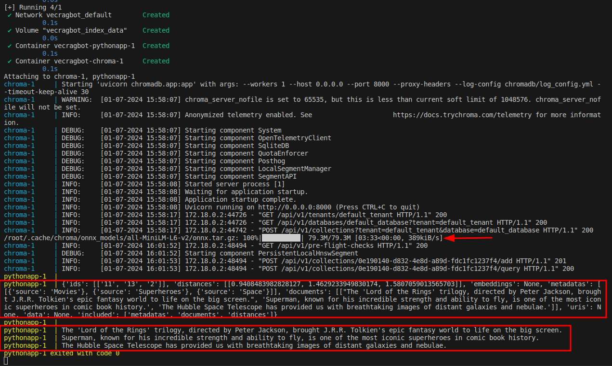

1. You need to have installed docker and docker compose

2. Project should be started with simple "docker compose up" command from the main folder

App works as a vector search, querying through provided 10 strings in main.py.

In the same same console, after docker compose up command has been started, at the end of building project process, you should be able to see 3 matched answers for your query inside main.py file.
Change query in main.py 35 line, to retrieve best matched strings from document array [6-20 line]. You can change either question or answers inside the file, it is up to you.

**If you changed the project/branch, and you have allready created images/containers**
**please remove them before starting new app :** 

- "docker container ps -a" : find your 2 containers ids
- "docker stop pythonContainerId chromaContainerId && docker rm pythonContainerId chromaContainerId"
- "docker rmi vecragbot-pythonapp" - to remove built pythonapp image

After containers were created, chroma had to initialize LLM. It will take a few minutes or seconds, based on your internet connection.
Next it will return unstructured responses, with similarity score - closer to 1 is the best response.
At the end wee see structured data, first position is the closest match. 

On below screenshot we can see the result, where the query is "Give me some facts about Lord of the rings"

